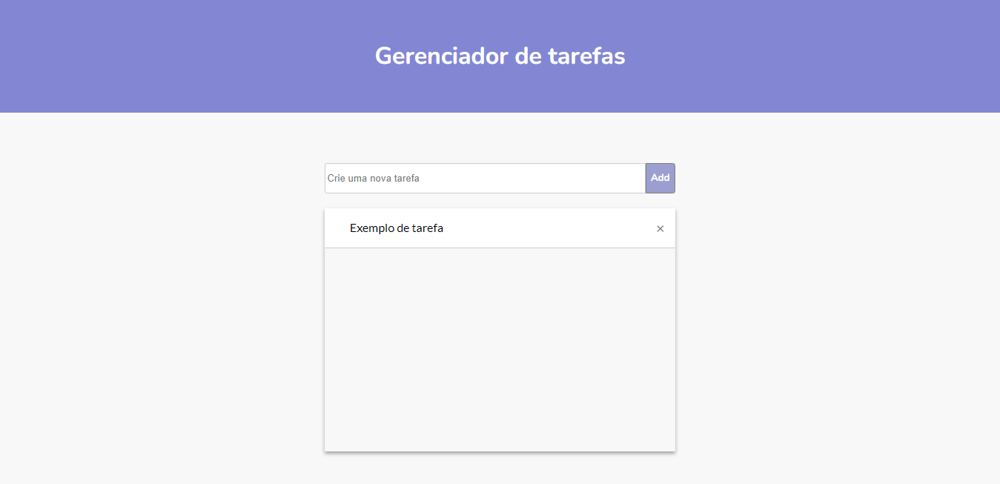

<h1 align="center">
   Gerenciador de Tarefas
</h1>

  <a href="https://willianstephano.github.io/To-Do-List/">
    <b>🚀Acesse o projeto 🚀</b>
  </a>
  
  <h5 align="center">
  🛠️ Em construção 
</h5>

<h4 align="center">
  Projeto criado com o intuito de aprimorar meus conhecimentos nas tecnologias HTML, CSS e Js.
</h4>

## 📚 Seções
O projeto é composto por uma pagina que contem uma unica seção principal:

- **Lista de tarefas:** Lista de todas as tarefas criadas em conjunto com um campo para adicionar novas tarefas;

---

## 💼 Tecnologias utilizadas
Para o desenvolvimento deste projeto utilizei as seguintes tecnologias:

- HTML;
- CSS;
- Js;
---

#### Autor
Willian Stephano
